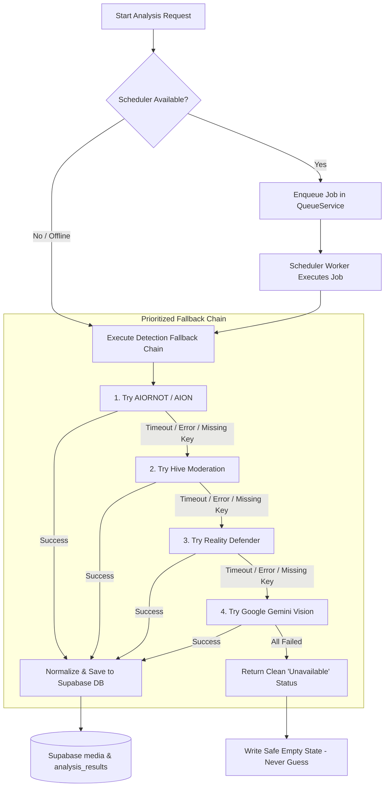
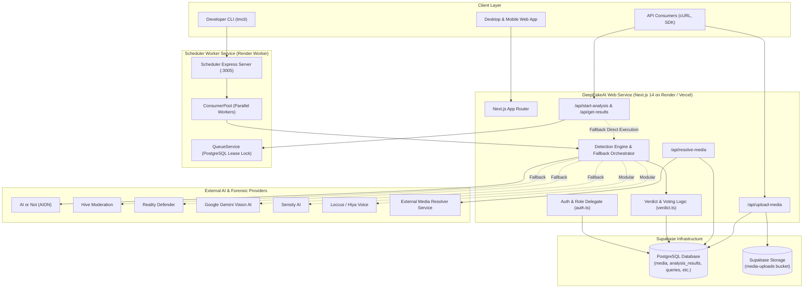

# DeepFakeAI

[](https://deepfakeai.onrender.com/)
[](https://github.com/satyamhq/DeepFakeAI)
[](https://nodejs.org/)
[](https://nextjs.org/)
[](https://supabase.com/)
[](./LICENSE)
[](https://turbo.build/repo)

**DeepFakeAI** is a multi-modal deepfake detection and verification platform designed to identify AI-generated, synthetic, and manipulated media across the web. DeepFakeAI ingests social media links or uploaded files (images, video, audio), orchestrates detection across an ensemble of state-of-the-art forensic AI detectors, and aggregates the findings into clear, explainable, and tamper-resistant verdicts.

---

## Table of Contents

- [Project Overview](#project-overview)
  - [The Problem](#the-problem)
  - [The Solution](#the-solution)
  - [How It Works](#how-it-works)
- [Key Features](#key-features)
- [AI & Detection Providers](#ai--detection-providers)
  - [Provider Implementation Status](#provider-implementation-status)
  - [Fault-Tolerant AI Fallback Engine](#fault-tolerant-ai-fallback-engine)
- [Complete Tech Stack](#complete-tech-stack)
- [System Architecture](#system-architecture)
- [Repository & Folder Structure](#repository--folder-structure)
- [API Architecture & Routes](#api-architecture--routes)
- [Supabase Infrastructure](#supabase-infrastructure)
  - [Database Schema & Migrations](#database-schema--migrations)
  - [Supabase Storage](#supabase-storage)
  - [Row-Level Security (RLS)](#row-level-security-rls)
- [Authentication, Roles & Access Control](#authentication-roles--access-control)
- [Media Upload & Processing Pipeline](#media-upload--processing-pipeline)
- [AI Detection & Scoring Pipeline](#ai-detection--scoring-pipeline)
  - [Voting Classification Logic](#voting-classification-logic)
  - [Ensemble Scoring Model](#ensemble-scoring-model)
  - [Explainability & Rationales](#explainability--rationales)
- [Scheduler & Background Processing](#scheduler--background-processing)
- [Environment Variables](#environment-variables)
- [Local Development Setup](#local-development-setup)
- [Testing, Linting, Type Checking & Build](#testing-linting-type-checking--build)
- [Deployment Guide](#deployment-guide)
  - [Render Deployment (Primary Production)](#render-deployment-primary-production)
  - [Vercel Deployment (Alternative / Serverless)](#vercel-deployment-alternative--serverless)
- [Error Handling & API Reliability](#error-handling--api-reliability)
- [Security Considerations](#security-considerations)
- [Project Status & Roadmap](#project-status--roadmap)
- [License](#license)
- [Disclaimer](#disclaimer)

---

## Project Overview

### The Problem

Generative artificial intelligence (diffusion models, voice cloning, GANs, face reenactment) has made the creation of hyper-realistic deceptive media accessible at scale. Deepfakes threaten:
- **Electoral integrity**: Manipulated videos or synthetic audio of candidates deployed during election cycles.
- **Journalistic trust**: Newsrooms overwhelmed by deceptive footage during breaking events.
- **Reputational safety**: Non-consensual imagery, financial fraud, and targeted disinformation campaigns.
- **Verification latency**: No single detection model has 100% accuracy across every artifact type, codec, or compression algorithm. Relying on an isolated detector produces false positives and leaves blind spots.

### The Solution

DeepFakeAI addresses this challenge through a multi-layered forensic approach:
1. **Multi-Modal Ensemble**: Rather than relying on a single black-box model, DeepFakeAI coordinates specialized detectors for images, video, and audio.
2. **Prioritized Fallback System**: If a commercial or third-party detector experiences an outage, rate limit, or timeout, DeepFakeAI automatically switches to available providers in a resilient fallback chain—**without fabricating fake statistics or guessing**.
3. **Transparent Aggregation**: Scores are weighted through voting heuristics and affine ensemble models with confidence scores, anomaly flags, and natural language explanations.
4. **Open Access & High Availability**: Supports both instant anonymous public queries (`ANON_QUERY=true`) and role-based enterprise access via API keys and Supabase Auth.

### How It Works

```
┌─────────────────┐       ┌─────────────────────────┐       ┌────────────────────────┐
│ User Ingestion  │ ────► │ Media Resolution /      │ ────► │ Storage & Persistence  │
│ (URL or Upload) │       │ Format Validation       │       │ (Supabase S3 & DB)     │
└─────────────────┘       └─────────────────────────┘       └────────────────────────┘
                                                                        │
                                                                        ▼
┌─────────────────┐       ┌─────────────────────────┐       ┌────────────────────────┐
│ Web Presentation│ ◄──── │ Scoring & Explainability│ ◄──── │ AI Detection Engine    │
│ & API Response  │       │ (Voting / Ensemble)     │       │ (Orchestrator/Fallback)│
└─────────────────┘       └─────────────────────────┘       └────────────────────────┘
```

1. **Ingest**: A user submits a social media link (X, TikTok, YouTube, Mastodon, Reddit, Facebook, Instagram, Google Drive) or uploads a raw file (PNG, JPG, MP4, MOV, MP3, WAV, etc.).
2. **Resolve & Store**: The media is downloaded or resolved, hashed with SHA-256 for deduplication, stored in Supabase Storage, and recorded in the Supabase PostgreSQL database.
3. **Dispatch**: The analysis is queued via the `@truemedia/scheduler` background worker or processed synchronously through the `detectionEngine` fallback chain.
4. **Detect**: The system dispatches requests to configured AI providers (AI or Not, Hive Moderation, Reality Defender, Google Gemini Vision, Sensity, Loccus, etc.).
5. **Aggregate**: Individual raw model responses are normalized into standard ranks (`low`, `uncertain`, `high`), fake probabilities, and confidence metrics.
6. **Report**: The web interface and JSON API surface the aggregated verdict, individual detector breakdown, and AI-generated forensic explanations.

---

## Key Features

- 🌐 **Social Media Post Resolution**: Extracts and caches media streams from major platforms via the Media Resolver integration.
- 📁 **Direct File Upload**: Supports files up to 100MB across 19+ media extensions directly to Supabase Storage.
- 🔄 **Fault-Tolerant AI Fallback**: Resilient cascading provider pipeline that handles network timeouts, provider downtime, and unconfigured keys seamlessly.
- 🛡️ **Zero-Fabrication Integrity**: Never invents results or generates fake statistical reports when models are unreachable.
- ⚖️ **Voting & Ensemble Classification**: Dual-mode verdict generation combining rule-based voting policies and weighted logistic ensembles.
- 🧠 **Explainable AI Rationales**: Synthesizes generative forensic observations using Google Gemini Vision and OpenAI models.
- ⚡ **Background Queue & Workers**: Distributed queueing system with PostgreSQL advisory leases, priority levels (`live`, `batch`), and automatic cleanup.
- 🔑 **API Key & Role Management**: Multi-tier permissions (Anonymous, User, Friend, Internal, Admin) with granular rate limiting.
- 🔍 **Internal Review & Ground Truth**: Internal toolset for fact-checkers to mark ground truth, flag notable media, and track accuracy metrics.
- 📊 **Telemetry & Automated Monitors**: Background cron jobs tracking provider error rates, trending queries, resolution bottlenecks, and spike alerts.

---

## AI & Detection Providers

DeepFakeAI integrates with commercial detection platforms, foundational generative models, and research-grade forensic algorithms.

### Provider Implementation Status

| Provider | Modality | Integration Scope | Environment Key | Status |
|---|---|---|---|---|
| **AI or Not (AION)** | Image, Audio | Primary Fallback Provider 1; detects synthetic generation patterns | `AION_API_KEY` / `AIORNOT_API_KEY` | ✅ **Active & Implemented** |
| **Hive Moderation** | Image, Video, Audio | Primary Fallback Provider 2 & Async Webhooks; multi-modal classification | `HIVE_API_KEY` / `HIVE_SECRET_KEY` | ✅ **Active & Implemented** |
| **Reality Defender** | Image, Video, Audio | Primary Fallback Provider 3; S3 presigned upload & multi-model suite | `REALITY_API_KEY` | ✅ **Active & Implemented** |
| **Google Gemini Vision** | Image, Multimodal | Primary Fallback Provider 4 (`gemini-1.5-flash`, `gemini-1.5-pro`); visual artifact analysis | `GEMINI_API_KEY` | ✅ **Active & Implemented** |
| **Sensity AI** | Image, Video, Audio | Visual face-swap, video manipulation, and voice cloning detection | `SENSITY_API_TOKEN` | 🟡 **Configured** (Requires Key) |
| **Loccus / Hiya AI** | Audio | Voice authenticity & cloned audio detector | `LOCCUS_API_KEY` | 🟡 **Configured** (Requires Key) |
| **Deepfake Total (Fraunhofer)** | Audio | Audio artifact and spectral analysis | `DFTOTAL_API_KEY` | 🟡 **Configured** (Requires Key) |
| **OpenAI (GPT-4 / Vision)** | Text, Audio, Image | Rationale extraction, transcript analysis, and artwork anomaly detection | `OPENAI_API_KEY` / `GEMINI_API_KEY` | 🟡 **Configured** (Requires Key) |
| **In-House / Research Models** | Image, Video | Forensic algorithms (`dire`, `ufd`, `genconvit`, `ftcn`, `styleflow`, `buffalo`, `reverse-search`) | Service Endpoints | 🔬 **Specialized / Modular** |

### Fault-Tolerant AI Fallback Engine

DeepFakeAI features a production-grade fallback orchestrator located in [`apps/detect/app/services/detectionEngine.ts`](file:///d:/DeepFakeAI/apps/detect/app/services/detectionEngine.ts).

When media is submitted for analysis:



#### Guarantees of the Fallback Engine
1. **Enforced Timeouts**: Every external API call is wrapped in a strict 15-second timeout (`TIMEOUT_MS = 15000`) using `Promise.race`, preventing hanging worker processes.
2. **Transparent Error Logging**: Provider errors are captured and recorded in the `analysis_results` table with `requestState = 'ERROR'` to facilitate telemetry, auditing, and debugging without breaking the user experience.
3. **Strict Non-Fabrication**: If all configured providers are exhausted, timed out, or uncredentialed, the platform sets `results: {}` and returns a transparent user notice: *"AI detection is temporarily unavailable. Please try again later."* The system **never fabricates synthetic results, guesses probabilities, or simulates mock scores**.

---

## Complete Tech Stack

| Category | Technology | Purpose & Details |
|---|---|---|
| **Monorepo Engine** | **Turborepo** (`turbo` v2) | Multi-package pipeline caching, scoped builds (`@truemedia/detect`, `@truemedia/scheduler`, `@truemedia/tmcli`) |
| **Package Manager** | **npm** (v10+ workspaces) | Root-level dependency resolution and workspace orchestration |
| **Frontend Framework** | **Next.js 14.2** (App Router) | Server Components, Route Handlers, Streaming SSR, dynamic routing |
| **UI Library** | **React 18** | Client interactive components, state hooks, suspense boundaries |
| **Styling & Design** | **TailwindCSS 3.4** & **Flowbite** | Utility-first styling, glassmorphism cards, responsive dark/light layouts |
| **Data Fetching** | **TanStack React Query v5** | Client-side cache synchronization, polling, optimistic updates |
| **API RPC Layer** | **tRPC v11** (`@trpc/server`, `@trpc/client`) | End-to-end type-safe RPC communication between Next.js and Scheduler |
| **Database** | **Supabase PostgreSQL** | Cloud-native relational database; manages users, media, queries, and results |
| **Database Client** | **`@supabase/supabase-js`** | Pure Supabase SDK client layer replacing legacy ORM dependencies |
| **Authentication** | **Supabase Auth** & Open Access | Role-based permission hierarchy (0 to 4), API keys, and open anonymous mode |
| **Object Storage** | **Supabase Storage** | S3-compatible asset storage for raw media files (`media-uploads` bucket) |
| **Background Scheduler** | **Express 4 + tRPC Worker** | Dedicated Node.js microservice (`@truemedia/scheduler`) with lease-based queues |
| **AI Vision & Forensics** | **Google Generative AI**, Reality Defender SDK, Hive REST | Direct model integrations for artifact detection and generative rationales |
| **Image Processing** | **Sharp** | High-performance image manipulation, resizing, and metadata inspection |
| **Validation & Types** | **Zod 3.23** & **TypeScript 5.6** | Runtime schema validation for API bodies, query params, and queue messages |
| **Logging** | **Pino 9** & **Pino-pretty** | Structured JSON logging with multi-level severity and log stream formatting |
| **Telemetry & Alerts** | **Sentry** (`@sentry/nextjs`) & **Slack Web API** | Production error monitoring, release tracking, and automated Slack alert webhooks |
| **Testing** | **Jest 29** & Testing Library | Unit tests, model processor tests, verdict aggregation specs |
| **Production Hosting** | **Render** | Production Web Service (`deepfakeai-web`) & Background Worker (`deepfakeai-scheduler`) |
| **Edge Hosting** | **Vercel** | Serverless Next.js deployment option with 7 scheduled cron workers |

---

## System Architecture



---

## Repository & Folder Structure

```
DeepFakeAI/
├── .env.example                 # Master environment variable template with documentation
├── .gitignore                   # Git ignore patterns for dependencies, builds, and keys
├── .nvmrc                       # Node.js version specification (v20)
├── CLAUDE.md                    # Core architectural and code-style guidelines
├── LICENSE                      # MIT Open Source License
├── README.md                    # Comprehensive project documentation
├── package.json                 # Monorepo root scripts, workspaces, and devDependencies
├── render.yaml                  # Render blueprint for Web Service and Background Worker
├── turbo.json                   # Turborepo pipeline configuration and environment caching
├── vercel.json                  # Vercel deployment settings and scheduled cron routines
│
├── apps/
│   ├── detect/                  # Primary Next.js 14 Web Application
│   │   ├── app/
│   │   │   ├── actions/         # Next.js Server Actions (media resolution, metadata)
│   │   │   ├── api/             # RESTful API Route Handlers
│   │   │   │   ├── check-analysis/         # Status polling for asynchronous analyses
│   │   │   │   ├── check-complete/         # Cron: checks pending analyses completion
│   │   │   │   ├── get-results/            # Media analysis result retrieval & score calculation
│   │   │   │   ├── get-verdicts/           # Bulk verdict retrieval for multiple media IDs
│   │   │   │   ├── history-export/         # User query history CSV export
│   │   │   │   ├── hive-webhook/           # Hive Moderation asynchronous callback receiver
│   │   │   │   ├── media-metadata/         # Fact-checking and metadata management
│   │   │   │   ├── post-to-x/              # X (Twitter) automated verdict bot
│   │   │   │   ├── process-reruns/         # Cron: reprocesses queued model reruns
│   │   │   │   ├── rd-webhook/             # Reality Defender asynchronous callback receiver
│   │   │   │   ├── recompute-scores/       # Internal tool for updating historical model weights
│   │   │   │   ├── resolve-media/          # Ingests and extracts social media URLs
│   │   │   │   ├── start-analysis/         # Triggers queued or direct detection jobs
│   │   │   │   ├── starters/               # Dispatchers for specific detector endpoints
│   │   │   │   ├── thumbnail-overlay/      # Dynamic Open Graph thumbnail and badge generation
│   │   │   │   ├── trpc/                   # tRPC API gateway endpoint
│   │   │   │   ├── upload-media/           # Direct multipart file upload to Supabase Storage
│   │   │   │   ├── verified-source/        # Whitelist and verified publisher checking
│   │   │   │   └── watch-*/                # Production health, error, and anomaly monitoring
│   │   │   ├── components/      # Shared React components (Navigation, Cards, Badges)
│   │   │   ├── data/            # Domain logic (verdict.ts, model.ts, media.ts, groundTruth.ts)
│   │   │   ├── internal/        # Internal administrative, evaluation, and labeling tools
│   │   │   ├── media/           # Analysis views, results pages, upload UI, user history
│   │   │   ├── model-processors/# Adapters and parsers for detector responses (Hive, RD, AION)
│   │   │   ├── services/        # Orchestration services:
│   │   │   │   ├── detectionEngine.ts      # Multi-provider fallback chain & normalization
│   │   │   │   ├── mediares.ts             # Media Resolver integration client
│   │   │   │   └── scheduler.ts            # tRPC client connecting Next.js to Scheduler
│   │   │   ├── auth.ts          # Application role system (Anonymous to Admin)
│   │   │   ├── db.ts            # Supabase PostgreSQL client delegate & Storage methods
│   │   │   ├── server.ts        # Server-only utilities, tRPC root router, role helpers
│   │   │   └── supabase.ts      # Supabase client instantiation
│   │   ├── public/              # Static public assets (icons, brand marks, demo files)
│   │   ├── next.config.js       # Next.js configuration with security headers & Sentry
│   │   └── package.json         # Detect workspace dependencies and scripts
│   │
│   ├── scheduler/               # Background Job Scheduler Microservice
│   │   ├── src/
│   │   │   ├── appRouter.ts     # tRPC router exposing enqueue and queue management
│   │   │   ├── config.ts        # Worker configuration & dynamic scratch storage
│   │   │   ├── consumers.ts     # ConsumerPool managing concurrent job workers
│   │   │   ├── db.ts            # Direct Supabase PostgreSQL data layer for the queue
│   │   │   ├── dbTypes.ts       # TypeScript interfaces for queue messages and priorities
│   │   │   ├── jwt.ts           # Shared secret HMAC JWT verification
│   │   │   ├── queue.ts         # QueueService implementing PostgreSQL lease locks
│   │   │   └── server.ts        # Express entrypoint listening on port 3005
│   │   └── package.json         # Scheduler workspace dependencies
│   │
│   └── tmcli/                   # Developer CLI Tool
│       ├── src/cmds/            # CLI commands for batch testing, media resolution, scheduler
│       └── package.json         # CLI dependencies (Commander, Chalk, Ora, Listr2)
│
├── packages/
│   ├── clients/                 # Shared tRPC client libraries for Detect and Mediares
│   ├── config-eslint/           # Shared ESLint linting rules
│   └── config-typescript/       # Shared tsconfig.json configurations
│
└── supabase/
    └── migrations/
        └── 20260912000000_init_supabase_schema.sql  # Consolidated Supabase PostgreSQL schema
```

---

## API Architecture & Routes

The primary web application exposes a comprehensive RESTful and RPC API under `apps/detect/app/api/`:

| Endpoint | Method | Auth Required | Description |
|---|---|---|---|
| `/api/upload-media` | `POST` | Optional (if `ANON_QUERY=true`) | Uploads raw media (up to 100MB) directly to Supabase Storage and creates a media record. |
| `/api/resolve-media` | `POST` | Optional (if `ANON_QUERY=true`) | Resolves a social post URL (X, TikTok, YouTube, etc.) to extract raw media streams. |
| `/api/start-analysis` | `GET` / `POST` | Optional | Enqueues detection jobs in Scheduler worker or runs detection fallback chain. |
| `/api/get-results` | `GET` | Optional | Fetches analysis results, computes aggregate verdict, and returns detailed model scores. |
| `/api/check-analysis` | `POST` | Session / API Key | Polls external async detector endpoints (e.g. Sensity) for completion. |
| `/api/get-verdicts` | `POST` | Session / API Key | Batch endpoint to fetch aggregated verdicts for an array of media IDs. |
| `/api/recompute-scores` | `POST` | Admin / Internal | Recomputes scores and verdicts for historical records based on updated weights. |
| `/api/verified-source` | `GET` / `POST` | Public / Admin | Checks or registers known trusted publisher accounts (e.g. verified newsrooms). |
| `/api/rd-webhook` | `POST` | Reality Defender HMAC | Webhook receiver for Reality Defender asynchronous analysis completions. |
| `/api/hive-webhook` | `POST` | Hive Signature | Webhook receiver for Hive Moderation asynchronous processing results. |
| `/api/thumbnail-overlay` | `GET` | Public | Generates dynamic image cards with verdict badges for social sharing cards. |
| `/api/post-to-x` | `POST` | Internal / Bot Key | Publishes detection verdicts and link previews to X (Twitter). |
| `/api/history-export` | `GET` | User / Admin | Generates and streams a downloadable CSV of user query history. |
| `/api/trpc/*` | `ALL` | Bearer Token / Shared Secret | tRPC router endpoint serving scheduler callbacks and internal clients. |

---

## Supabase Infrastructure

DeepFakeAI relies on **Supabase** as its unified cloud infrastructure provider, completely replacing legacy ORM layers with pure, type-safe `@supabase/supabase-js` database delegates.

### Database Schema & Migrations

The complete, consolidated production schema is maintained in [`supabase/migrations/20260912000000_init_supabase_schema.sql`](file:///d:/DeepFakeAI/supabase/migrations/20260912000000_init_supabase_schema.sql).

#### Core Tables
- `users`: User profiles, email addresses, and roles (`ANONYMOUS`, `REGISTERED`, `API`).
- `organizations` & `organization_members`: Multi-tenant organization support and team access.
- `api_keys`: Cryptographic API keys for programmatically accessing the detection endpoints.
- `media`: Central catalog of media files, mime types, duration, file sizes, Supabase Storage URLs, and cached results JSON.
- `analysis_results`: Detailed individual detector outputs, raw JSON payloads, request state (`UPLOADING`, `PROCESSING`, `COMPLETE`, `ERROR`), and completion timestamps.
- `queries`: Historical audit log of all URL or file queries executed by users or anonymous visitors.
- `queue_messages`: Lease-based message queue powering the `@truemedia/scheduler` background worker.
- `notable_media`: Featured high-impact deepfakes surfaced on the home dashboard.
- `quiz_media`: Media samples curated for public media-literacy awareness quizzes.
- `verified_source`: Known authentic institutional sources used to bypass false-positive detection.
- `user_feedback`: User reports, feedback ratings, and correction requests.
- `rate_limits` & `media_throttle`: Dynamic throttling and per-user consumption tracking.

### Supabase Storage

Media files are uploaded to an S3-compatible Supabase Storage bucket (`media-uploads`, with automatic failover to `media`).
- **File Upload Function**: [`uploadMediaToStorage()`](file:///d:/DeepFakeAI/apps/detect/app/db.ts#L36) uploads binary buffers directly to Supabase Storage with `upsert: true`.
- **Public CDN URLs**: Generated immediately via `supabase.storage.from(bucket).getPublicUrl(path)` and linked to the media record.

### Row-Level Security (RLS)

PostgreSQL Row-Level Security is active across all tables in Supabase. Clean, permissive production policies are defined for:
- `anon`: Allows read access to media, notable items, and insertion of anonymous queries when `ANON_QUERY=true`.
- `authenticated`: Grants users access to their private query histories, feedback submissions, and organization data.
- `service_role`: Full unconstrained access for backend processes, server actions, and the scheduler worker.

---

## Authentication, Roles & Access Control

DeepFakeAI implements a custom role-based access hierarchy defined in [`apps/detect/app/auth.ts`](file:///d:/DeepFakeAI/apps/detect/app/auth.ts):

| Level | Role Name | Permissions |
|---|---|---|
| **0** | `anonymous` | Public queries, file uploads, viewing verdicts (when `ANON_QUERY=true`). |
| **1** | `user` | Authenticated access, personal query history, saved searches. |
| **2** | `friend` | Read-only access to select internal evaluation dashboards and metrics. |
| **3** | `internal` | Domain-restricted access (`@deepfakeai.org`), metadata editing, ground truth labeling. |
| **4** | `admin` | Full administrative privileges, user management, recomputing model scores. |

### API Key Authentication

Enterprise and programmatic consumers authenticate by providing an `x-api-key` HTTP header. The authorization handler [`checkApiAuthorization`](file:///d:/DeepFakeAI/apps/detect/app/api/apiKey.ts) looks up the active key in the `api_keys` table and enforces rate limits:
- **Anonymous**: 100 requests per hour.
- **API Users**: 10 requests per 10 seconds (configurable per key).
- **Registered Users**: Uncapped default with abusive behavior throttling.

---

## Media Upload & Processing Pipeline

```
1. Client selects file (PNG, JPG, MP4, MOV, WAV, etc.)
   │
2. POST /api/upload-media (Multipart Form-Data, max 100MB)
   │
   ├─► Validate mime type & extension against supported list
   ├─► Compute SHA-256 hash of buffer for immutable Media ID deduplication
   ├─► Upload buffer to Supabase Storage bucket ('media-uploads')
   ├─► Insert Media record in Supabase PostgreSQL
   │
3. POST /api/start-analysis
   │
   ├─► Check if Scheduler worker is reachable
   │    ├─ If YES: Enqueue in PostgreSQL 'queue_messages' table
   │    └─ If NO: Dispatch to direct synchronous DetectionEngine fallback
   │
4. Client polls GET /api/get-results?id=<mediaId>
   │
   ├─► If pending: returns state = 'PROCESSING'
   └─► If finished: calculates voting/ensemble verdict, generates rationale, returns JSON
```

---

## AI Detection & Scoring Pipeline

### Voting Classification Logic

The production decision system uses a robust voting heuristic defined in [`apps/detect/app/data/verdict.ts`](file:///d:/DeepFakeAI/apps/detect/app/data/verdict.ts):
- Models are categorized as `include` (1 vote) or `trust` (2 votes).
- A detector votes "fake" when its score exceeds its calibrated threshold (`scoreMeansFake`).
- **Verdict Thresholds**:
  - **High (`high`)**: Media receives **2 or more fake votes**. Represents substantial evidence of manipulation.
  - **Uncertain (`uncertain`)**: Media receives **1 fake vote**. Represents conflicting or ambiguous detector signals.
  - **Low (`low`)**: Media receives **0 fake votes**. Indicates little to no evidence of synthetic tampering.
- **Visual Noise Protection**: If a media file barely reaches `high` and all votes originate from noise-sensitive models, the platform automatically demotes the verdict to `uncertain` to prevent false alarms.

### Ensemble Scoring Model

For deeper forensic review, DeepFakeAI includes an affine logistic ensemble model:
$$\text{Score} = \frac{1}{1 + e^{-\left(\beta_0 + \sum \beta_i \cdot x_i\right)}}$$
Where:
- $\beta_0$ represents the media-type intercept.
- $\beta_i$ represents empirical model weights derived from validation datasets.
- Missing model results are substituted with calibrated baseline scores ($0.25$).
- For video files containing audio, the overall score adopts the higher manipulation score between visual frames and audio tracks.

### Explainability & Rationales

DeepFakeAI does not just return a raw percentage score. The system pairs every verdict with natural language forensic rationales:
- **Visual Inspection**: Google Gemini Vision inspects anatomical anomalies, lighting consistency, reflection symmetries, and pixel blending artifacts.
- **Reverse Search & Context**: Highlights whether identical media exists in verified archival repositories.
- **Audio Transcript Analysis**: Cross-references synthetic speech markers, background acoustic discontinuities, and vocal resonance patterns.

---

## Scheduler & Background Processing

For high-throughput environments, DeepFakeAI includes a standalone background worker microservice located in [`apps/scheduler`](file:///d:/DeepFakeAI/apps/scheduler).

### Scheduler Architecture
- **Worker Protocol**: Built on Express 4 and tRPC v11, communicating over HTTP with HMAC JWT tokens (`SCHEDULER_SHARED_AUTH_SECRET`).
- **Database Queue**: Stores tasks in the `queue_messages` table with advisory lease locks (`lease_expiration`, `lease_id`), ensuring no two workers process the same media item.
- **Priority Queues**:
  - `live`: Real-time user queries from the web interface.
  - `batch`: Bulk dataset evaluations, API batch uploads, and model reruns.
- **Automated Retention**: A recurring background poller purges completed messages older than the configured TTL (default: 60 seconds).
- **Direct Fallback**: If the scheduler worker service is stopped or unreachable, the web app's `start-analysis` API detects the outage and transparently runs the detection chain directly within the web process.

---

## Environment Variables

Copy `.env.example` to `.env` in your local environment.

> [!CAUTION]
> Never commit `.env` or expose production API keys or Supabase service role secrets in public repositories.

### Required Variables (Core Application)

| Variable | Description | Example / Default |
|---|---|---|
| `SUPABASE_URL` | Supabase project URL (Project Settings → API) | `https://your-project-ref.supabase.co` |
| `SUPABASE_PUBLISHABLE_KEY` | Supabase anonymous / publishable key | `sb_publishable_...` |
| `SUPABASE_SECRET_KEY` | Supabase service-role secret key | `sb_secret_...` |
| `NEXT_PUBLIC_SUPABASE_URL` | Client-accessible Supabase URL | `https://your-project-ref.supabase.co` |
| `NEXT_PUBLIC_SUPABASE_ANON_KEY`| Client-accessible Supabase anon key | `sb_publishable_...` |
| `ANON_QUERY` | Enables open public access without requiring login | `true` |
| `SCHEDULER_URL` | URL of the background scheduler service | `http://localhost:3005` |
| `SCHEDULER_SHARED_AUTH_SECRET` | 32-byte shared secret for Next.js ↔ Worker JWTs | `openssl rand -hex 32` |
| `MEDIA_RESOLVER_URL` | URL of the external social media resolver service | `http://localhost:4000` |

### Optional Configuration & Feature Flags

| Variable | Description | Default |
|---|---|---|
| `NEXT_PUBLIC_SITE_URL_BASE` | Canonical public URL of the web application | `http://localhost:3000` |
| `SUPABASE_STORAGE_BUCKET` | Supabase Storage bucket for uploaded media | `media-uploads` |
| `POSTMARK_TOKEN` | Postmark server token for transactional emails | Unset |
| `SENTRY_AUTH_TOKEN` | Sentry token for source map uploads during build | Unset |
| `GROUND_TRUTH_UPDATE_EMAILS_ENABLED` | Sends email updates when ground truth is updated | `false` |
| `VERIFIED_LABEL_ENABLED` | Displays verified source badges in UI | `false` |

### AI Detection Provider Keys

| Variable | Provider | Purpose |
|---|---|---|
| `AIORNOT_API_KEY` / `AION_API_KEY` | AI or Not | Image and audio generative AI detection |
| `HIVE_API_KEY` / `HIVE_SECRET_KEY` | Hive Moderation | Multi-modal deepfake and generative detection |
| `REALITY_API_KEY` | Reality Defender | Multi-model forensic detection suite |
| `GEMINI_API_KEY` | Google Gemini | Vision analysis, rationales, and forensic explanations |
| `SENSITY_API_TOKEN` | Sensity AI | Visual manipulation and voice cloning detection |
| `LOCCUS_API_KEY` | Loccus / Hiya | Voice authenticity & synthetic speech analysis |
| `DFTOTAL_API_KEY` | Deepfake Total | Audio deepfake analysis |
| `OPENAI_API_KEY` | OpenAI | Forensic text analysis and artwork evaluation |

---

## Local Development Setup

### Prerequisites
- **Node.js**: `v20.x` or higher (verified with `.nvmrc`)
- **npm**: `v10.x` or higher
- **Supabase Account**: A free or self-hosted Supabase PostgreSQL project

### 1. Clone the Repository
```bash
git clone https://github.com/satyamhq/DeepFakeAI.git
cd DeepFakeAI
```

### 2. Install Dependencies
```bash
npm install
```

### 3. Configure Environment Variables
```bash
cp .env.example .env
```
Fill in your `SUPABASE_URL`, `SUPABASE_PUBLISHABLE_KEY`, and `SUPABASE_SECRET_KEY` in `.env`.

### 4. Apply Database Migrations to Supabase
You can apply the unified schema to your Supabase project in one of two ways:
- **Via Supabase Dashboard**: Open your project's **SQL Editor**, paste the contents of [`supabase/migrations/20260912000000_init_supabase_schema.sql`](file:///d:/DeepFakeAI/supabase/migrations/20260912000000_init_supabase_schema.sql), and click **Run**.
- **Via Supabase CLI**:
  ```bash
  supabase db push
  ```

### 5. Create Storage Bucket in Supabase
In your Supabase Dashboard:
1. Navigate to **Storage** → **New Bucket**.
2. Name the bucket `media-uploads`.
3. Set the bucket to **Public**.

### 6. Start Development Servers
Start both the web application and the background scheduler using Turborepo:
```bash
npm run dev
```
- Web Application: `http://localhost:3000`
- Scheduler Worker: `http://localhost:3005`

---

## Testing, Linting, Type Checking & Build

All scripts are orchestrated across the monorepo via Turborepo:

```bash
# Run type checking across all workspaces
npm run check-types

# Run ESLint across all apps and packages
npm run lint

# Automatically fix linting and formatting issues
npm run lint:fix
npm run format

# Run Jest unit and integration test suites
npm run test

# Run full CI validation locally (lint, check-types, build, test)
npm run ci

# Production build for all workspaces
npm run build

# Scoped build optimized for Render deployment
npm run build:render
npm run build:scheduler
```

---

## Deployment Guide

### Render Deployment (Primary Production)

The repository includes a ready-to-use [`render.yaml`](file:///d:/DeepFakeAI/render.yaml) specification defining both the Web Service and Background Worker.

#### 1. Web Service (`deepfakeai-web`)
- **Service Type**: Web Service
- **Runtime**: `Node` (Node 20 pinned via `.nvmrc`)
- **Build Command**: `npm run build:render`
- **Start Command**: `npm run start:render`
- **Health Check Path**: `/`
- **Environment Variables**:
  - Set `NODE_VERSION` to `20.18.0`.
  - Add all required Supabase credentials (`SUPABASE_URL`, `SUPABASE_SECRET_KEY`, `NEXT_PUBLIC_SUPABASE_URL`, `NEXT_PUBLIC_SUPABASE_ANON_KEY`).
  - Set `ANON_QUERY` to `true`.
  - Add available detector keys (`GEMINI_API_KEY`, `AIORNOT_API_KEY`, `HIVE_API_KEY`, `REALITY_API_KEY`).
  - Memory management is configured automatically with `--max-old-space-size=2048`.

#### 2. Background Worker (`deepfakeai-scheduler`)
- **Service Type**: Background Worker
- **Runtime**: `Node`
- **Build Command**: `npm run build:scheduler`
- **Start Command**: `npm run start:scheduler`
- **Environment Variables**:
  - `SUPABASE_URL` and `SUPABASE_SECRET_KEY`.
  - `SCHEDULER_SHARED_AUTH_SECRET` (linked directly from `deepfakeai-web`).
  - `WEBAPP_TRPC_URL` pointing to `https://<your-web-service>.onrender.com/api/trpc`.

### Vercel Deployment (Alternative / Serverless)

The repository supports Vercel deployment via [`vercel.json`](file:///d:/DeepFakeAI/vercel.json):
- **Install Command**: `npm ci`
- **Build Command**: `node -v && npm run build`
- **Output Directory**: `apps/detect/.next`
- **Automated Vercel Crons**:
  - `/api/process-reruns`: Runs every 3 minutes.
  - `/api/check-complete`: Runs every 3 minutes.
  - `/api/media-metadata/poll-human-verifications`: Runs every minute.
  - `/api/watch-provider-errors`: Runs hourly.
  - `/api/watch-trending-queries`: Runs hourly.
  - `/api/watch-resolution-errors`: Runs hourly.
  - `/api/watch-user-signups-spiking`: Runs hourly.

---

## Error Handling & API Reliability

- **Graceful UI Degradation**: Wrapped in React 18 error boundaries (`apps/detect/app/components/ErrorBoundary.tsx`) to prevent rendering crashes if individual model widgets fail.
- **Detector Timeout Circuit**: Prevents slow external third-party endpoints from stalling response times; individual detector calls abort after 15 seconds.
- **Failover Persistence**: Failures are logged directly to the `analysis_results` table with error messages, ensuring an auditable record of provider stability.
- **Rate-Limiter Circuit**: In-memory and database-backed rate limiters defend the platform from denial-of-service attempts on heavy media endpoints.

---

## Security Considerations

- **SHA-256 Content Addressing**: Files are fingerprinted immediately upon upload to prevent duplicate processing attacks and ensure asset immutability.
- **MIME & Extension Whitelisting**: Restricts uploads strictly to known safe image, video, and audio codecs; executable binaries and arbitrary files are rejected with HTTP 415.
- **HMAC Shared Secret Verification**: Communications between the Next.js frontend and the Scheduler worker are signed with HMAC JWTs.
- **Row-Level Security (RLS)**: Enforces database-level isolation so that anonymous clients cannot modify internal configuration or tamper with audit records.
- **No Secret Leakage**: API routes strip internal provider tokens and partner identifiers from external API responses, ensuring commercial partner keys remain secure.

---

## Project Status & Roadmap

### Current Status
- ✅ Multi-modal image, video, and audio deepfake analysis operational.
- ✅ Resilient multi-provider fallback engine (`AIORNOT` → `Hive` → `Reality Defender` → `Gemini Vision`) active.
- ✅ Supabase PostgreSQL and Supabase Storage data layer operational (no legacy Prisma/Clerk dependencies).
- ✅ Live demo deployed and functioning on Render.
- ✅ Open access mode enabled with anonymous query tracking.

### Roadmap
- [ ] **Expanded Video Model Suite**: Deep integration for frame-by-frame temporal anomaly detectors.
- [ ] **C2PA / Content Credentials Inspection**: Native verification of cryptographic provenance metadata embedded in compliant images and cameras.
- [ ] **Browser Extension**: Real-time social media inspection overlay for Chrome and Firefox.
- [ ] **Webhook Subscriptions**: Webhook notifications for enterprise clients to receive asynchronous results on large video files.

---

## License

This project is licensed under the terms of the **MIT License**. See the [LICENSE](./LICENSE) file for complete details.

---

## Disclaimer

> [!WARNING]
> **AI Detection Accuracy & Limitations**
> 
> Deepfake detection is an evolving probabilistic science. While DeepFakeAI combines multiple state-of-the-art forensic models and ensemble heuristics, **no automated detection system can guarantee 100% accuracy**.
> 
> False positives and false negatives can occur due to heavy compression, artistic filters, lighting anomalies, or novel generative techniques. The findings provided by DeepFakeAI are intended to assist human verification, fact-checking, and editorial scrutiny—**not to serve as absolute legal or judicial proof of authenticity**.
